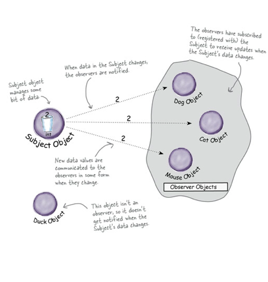

# Head first. Design Pattern

## Принципи проектирования

1. Выделите аспекты приложения, которые могут изменяться, и отделите их от тех, которые всегда остаються постоянными.
    - Выделите то, что изменяеться, и "инкапсулируйте" эти аспекти, чтобы они не влияли на роботу остального кода.
    - Результат? Меньше непревиденных последствий от изменения кода, большая гибкость ваших систем!
2. Програмируйте на уровне интерфейсов, а не на уровне реализации.
3. Отдавайте предпочтение композиции перед наследованием.
4. Слабосвязаные обьекты.
    - Если два обьекта могут взаимодествовать, не обладая практически никакой информацие друг о друге, такие обьекты называються слабосвязанными. 

## Стратегия
<strong>Паттерн Стратегия</strong> определят семейство алгоритмов, инкапсулирует каждый из них и обеспечивает их взаимозаменяемость. Он позволяет модифицировать алгоритмы независимо от их использования на стороне клиента.

------------------------------
### Links:
 
https://www.youtube.com/watch?v=v9ejT8FO-7I&t=0s&list=PLrhzvIcii6GNjpARdnO4ueTUAVR9eMBpc&index=2

------------------------------

### UML

------------------------------
### Code example 

- [Ducks](./src/Strategy/Example1)  
- [TaxCalculator](./src/Strategy/Example2) 

------------------------------
### TODO: 
- [ ] add UML diagram for the 2 example (`TaxCalculator`);
- [ ] improve https://www.reddit.com/r/laravel/comments/aju9mc/is_it_strategy_pattern/eezw001/ for example 2;

## Observer

<strong>Паттер Наблюдатель</strong> определяет отношение "один-ко-многим" между обьектами таким образом, что при изменении стостояния одного обьекта происходит автоматическое оповещение и обновление всех зависимых обьектов. 

<strong>В архитектуре паттерна Наблюдатель между судьектами и наблюдателями существует слабая связь:</strong>
- <strong>Единственнок, что знает субьект о наблюдателе, - то, что тот реализует некоторый интерфейс</strong> (Observer). Ему не нужно знать никонкретный класс наблюдателя, ни его функциональность... ничего.
- <strong>Новый наблюдатели могут добавляться в любой момент.</strong> Так как субьект зависит только от списка обьектов, реализуещих интерфейс Observer, вы можете добавлять новых наблюдателей по своему усмотрению. Любого наблюдателя во время выполнения можно заменить другим наблюдателем или исключить его из списка - субьект этого не заметит.
- <strong>Добавление новых типов наблюдателей не требует модификации субьекта. </strong> Допустим, у нас появился новый класс, который должен стать наблюдателем. Вносить изменения в субьект не потребуеться - достаточно реализировать интрфейс Observer в новом классе и зарегестрировать его в качестве наблюдателя. Субьект будет доставлять оповещения любому обьекту, реализуещему интерфейс Observer.
- <strong>Субьекты и наблюдатели могут повторно использоваться независимо друг от друга.</strong> Между ними не существует сильных связей, что позволяет повторно использовать их для других целей.
- <strong>Изменения в субьекте или наблюдателе не влияют на другую сторону.</strong> Благодаря слабым связям мы можем вносить любые изменения на любой из двух сторон - при условии, что обьект реализует необходимиый интерфейс субьекта или наблюдателя.

## TODO:
- [ ] add relation names for the UML;
