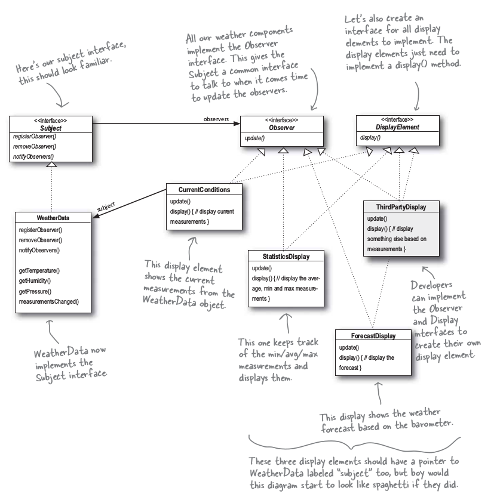
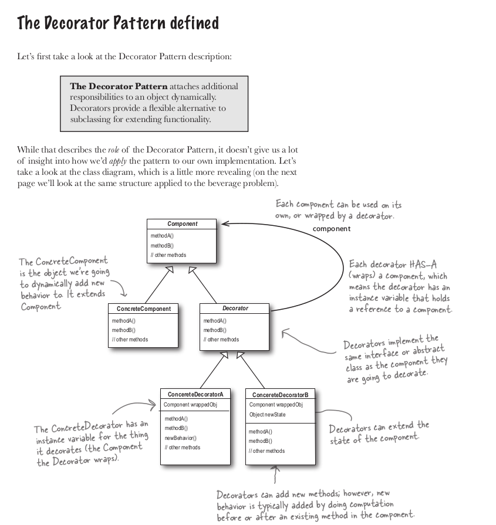
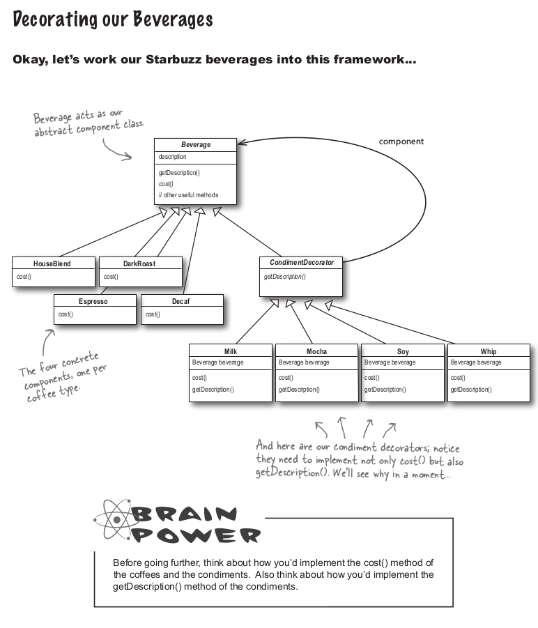
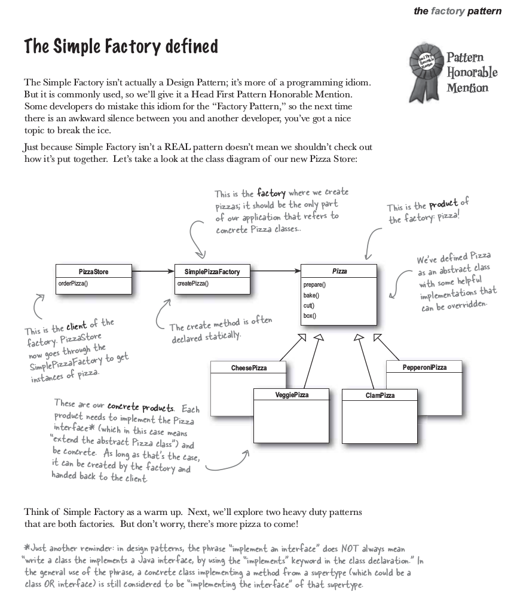
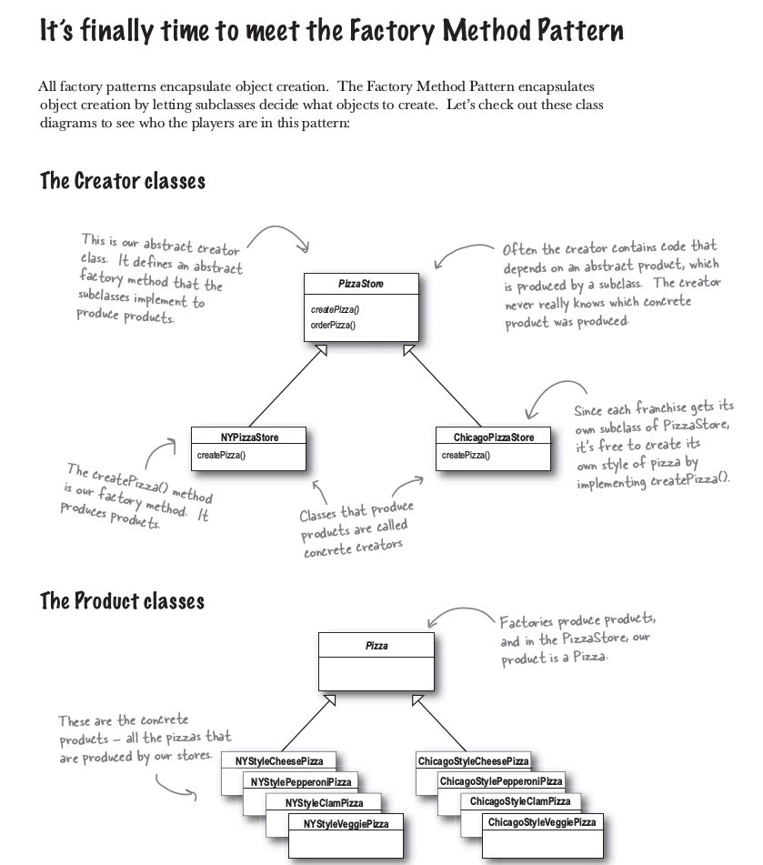

# Head first. Design Pattern

- [Принципи проектирования](#principe)
- [Strategy](#strategy)
- [Observer](#observer)
- [Decorator](#decorator)
- [Simple Factory](#simple-factory)
- [Factory Method](#factory-method)
- [Abstract Factory](#abstract-factory)
- [Command](./documentation/7-command.md)
- [Adapter](./documentation/8-adapter.md)
- [Facade](./documentation/9-facade.md)
- [TemplateMethod](./documentation/10-template-method.md)
- [Iterator](./documentation/11-iterator.md)
- [Composite](./documentation/12-composite.md)
- [State](./documentation/13-state.md)

--------------

<a name="principe"> <h2> Принципи проектирования </h2> </a>

1. Выделите аспекты приложения, которые могут изменяться, и отделите их от тех, которые всегда остаються постоянными.
    - Выделите то, что изменяеться, и "инкапсулируйте" эти аспекти, чтобы они не влияли на роботу остального кода.
    - Результат? Меньше непревиденных последствий от изменения кода, большая гибкость ваших систем!
2. Програмируйте на уровне интерфейсов, а не на уровне реализации.
3. Отдавайте предпочтение композиции перед наследованием.
4. Слабосвязаные обьекты.
    - Если два обьекта могут взаимодествовать, не обладая практически никакой информацие друг о друге, такие обьекты называються слабосвязанными. 
5. Open/Closed
    - Классы должны быть открыты для расширения, но закрыты для изменения.
6. Принцип инверсии зависимости
    - Код должен зависить от абстракци, а не от конкретных классов.
    - Высокоуровневые компоненты не должны зависить от низкоуровневых компонентов, вместо этого и те и другие должны зависить от абстракций
7. Принцип минимальной информированости: общайтесь только с близкими друьями. (in facade pattern)
8. Не вызывайте нас - мы вас сами вызовем (in template method)
9. Клас должен иметь только одну причину для изменения (iterator)

------------------------------

<a name="strategy"> <h2> Strategy </h2> </a>

<strong>Паттерн Стратегия</strong> определят семейство алгоритмов, инкапсулирует каждый из них и обеспечивает их взаимозаменяемость. Он позволяет модифицировать алгоритмы независимо от их использования на стороне клиента.

### Принципи проектирования

1. Выделите аспекты приложения, которые могут изменяться, и отделите их от тех, которые всегда остаються постоянными.
    - Выделите то, что изменяеться, и "инкапсулируйте" эти аспекти, чтобы они не влияли на роботу остального кода.
    - Результат? Меньше непревиденных последствий от изменения кода, большая гибкость ваших систем!
2. Програмируйте на уровне интерфейсов, а не на уровне реализации.
3. Отдавайте предпочтение композиции перед наследованием.

### Links:
 
https://www.youtube.com/watch?v=v9ejT8FO-7I&t=0s&list=PLrhzvIcii6GNjpARdnO4ueTUAVR9eMBpc&index=2

### UML

### Code example 

- [Ducks](./src/Strategy/Example1)  
- [TaxCalculator](./src/Strategy/Example2) 

-------------------

<a name="observer"> <h2> Observer </h2> </a>

<strong>Паттер Наблюдатель</strong> определяет отношение "один-ко-многим" между обьектами таким образом, что при изменении стостояния одного обьекта происходит автоматическое оповещение и обновление всех зависимых обьектов. 

<strong>В архитектуре паттерна Наблюдатель между судьектами и наблюдателями существует слабая связь:</strong>
- <strong>Единственнок, что знает субьект о наблюдателе, - то, что тот реализует некоторый интерфейс</strong> (Observer). Ему не нужно знать никонкретный класс наблюдателя, ни его функциональность... ничего.
- <strong>Новый наблюдатели могут добавляться в любой момент.</strong> Так как субьект зависит только от списка обьектов, реализуещих интерфейс Observer, вы можете добавлять новых наблюдателей по своему усмотрению. Любого наблюдателя во время выполнения можно заменить другим наблюдателем или исключить его из списка - субьект этого не заметит.
- <strong>Добавление новых типов наблюдателей не требует модификации субьекта. </strong> Допустим, у нас появился новый класс, который должен стать наблюдателем. Вносить изменения в субьект не потребуеться - достаточно реализировать интрфейс Observer в новом классе и зарегестрировать его в качестве наблюдателя. Субьект будет доставлять оповещения любому обьекту, реализуещему интерфейс Observer.
- <strong>Субьекты и наблюдатели могут повторно использоваться независимо друг от друга.</strong> Между ними не существует сильных связей, что позволяет повторно использовать их для других целей.
- <strong>Изменения в субьекте или наблюдателе не влияют на другую сторону.</strong> Благодаря слабым связям мы можем вносить любые изменения на любой из двух сторон - при условии, что обьект реализует необходимиый интерфейс субьекта или наблюдателя.

### Принципи проектирования

4. Слабосвязаные обьекты.
    - Если два обьекта могут взаимодествовать, не обладая практически никакой информацие друг о друге, такие обьекты называються слабосвязанными. 

### Examples:

[WeatherData](./src/Observer/Example1) - также можна добавить метод setChanged - и оповесчать наблюдателей, только когда `changed` - true.

------------------------------

<a name="decorator"> <h2> Decorator </h2> </a>

<strong>Паттер Декоратор</strong> динамечески наделяет обьекты новыми возможностями и являеться гибкой альтернативой субклассированию в области расширения функцональности.

### Принципи проектирования

5. Open/Closed
    - Классы должны быть открыты для расширения, но закрыты для изменения.

### Example
- [Beverage](./src/Decorator/Example1) | [Beverage2](./src/Decorator/Example2)

----------------------------------

<a name="simple-factory"> <h2> Factory Simple </h2> </a>

### Example

[Pizza](./src/Factory/PizzaSimpleFactory)

------------------------

<a name="factory-method"> <h2> Factory Method </h2> </a>

<strong>Фабричный метод</strong> - определяет интерфейс создания обьекта, но позволяет субклассам выбрать класс создаваемого екземпляра. Таким образом, Фабричный метод делегирует операцию создания экземпляра субклассам.

<strong>Фабричный метод</strong> отвечает за создание обьектов и инкапсулирует эту операцию в субклассе. Таким образом клиентский код в суперклассе отделяеться от кода создания обьекта в субклассе. 

### Example

[Pizza](./src/Factory/PizzaFactoryMethod)

-------------------------

<a name="abstract-factory"> <h2> Abstract Factory </h2> </a>

<strong>Паттерн Абстрактная Фабрика</strong> предоставлет интерфейс создания семесйства взаимосвязанных или взаимосвязаных обьектов без указания их конкретных классов.

### Example

[Pizza](./src/Factory/PizzaAbstractFactory)

### TODO
- [ ] Add UML from 188 page
- [ ] Add UML from 189 page
- [ ] Read page 190 - 193
- [ ] Complete example of AbstractFactory
- [ ] Watch https://www.youtube.com/watch?v=v-GiuMmsXj4&t=0s&list=PLrhzvIcii6GNjpARdnO4ueTUAVR9eMBpc&index=6

-------------------------------

## TODO:
- [ ] add relation names for the UML;
- [ ] Add notice about Singleton pattern
- [ ] Last question from the 167 page
- [ ] Read from the proxy pattern
