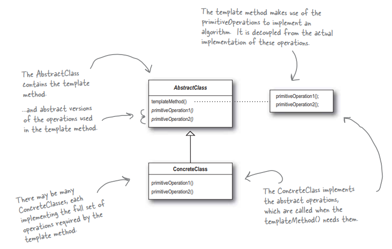

## Template method

<strong>Патерн Шаблонный метод</strong> задает "скелет" алгоритма в методе, оставляе определение реализации некоторых шагов субкассам. Субклассы могут переопределять некоторые части алгоритма без изменения его структуры.

### Example
- [SimpleBarista](./../src/TemplateMethod/SimpleBarista)
- [Barista](./../src/TemplateMethod/Barista)

### TODO:
- [ ] refactoring of `SimpleBarista`
- [ ] refactoring of `Barista`