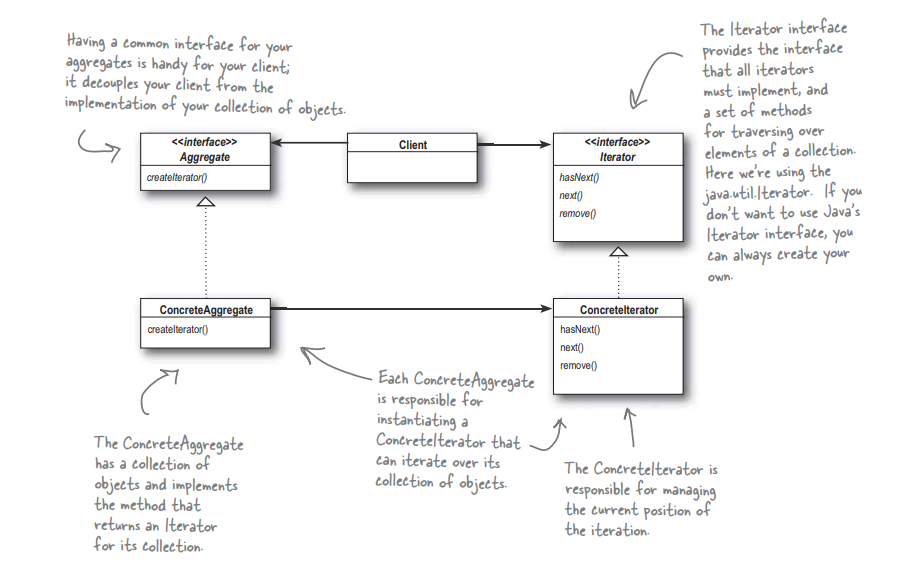

## Iterator

<strong>Паттерн Итератор</strong> предоставляет механизм последовательного перебора элементов коллекции без раскрытия ее внутреннего предоставления.



### Принцип одной обязаности
<strong>А если все-таки разрешить классам колекций реализовать как упавление обьектами, так и методы перебора? Да, это приведет к увеличению количества методов колекции, н и что? Чем это плоха?</strong>

Чтобы понять, чем это плохо, необходимо сначала осознать один факт: поручая классу не только его непосредственную задачу (управление коллекцией обьектов), но и дополнительные задачи (перебор), мы создаем две возможные причины для изменения. Теперь измениться может как внтреняя реализация коллекций, так и механихм перебора. Как видите, наш старый знакомый - ИЗМЕНЕНИЕ - снова оказываеться в центре очередного принципа проектирования:

```
Клас должен иметь только одну причину для изменения.
```

<p>Мы знаем, что изменений в классах следуем по возможности избегать - модицикация кода обычно сопровождаеться массой проблем. Наличие двух причин для изменения повышает аероятность того, что класс измениться в будущем, а если это все же произойдет - изменения повлияют на два аспекта архитектуры.</p>
<p>Что делать? Принцип указывает на то, что каждому классу должена быть выделена одна - и только одна! - обязанность.</p>

<p>Как это часто бывает, в реальной жизни все несколько сложнее: раздиление обязанностей в архитектуре являеться одной из самых сложных задач. Наш мозг склонен обьдинять аспекты поведения даже в том случае, если в действительности речь идет о двух разных обязаностях. Единственный путь к ее успешному решению - аналих архитектуры и отслеживание возможных причин изменения классов в ходе роста системы.</p>

### TODO:
- [ ] add examples of iterator
