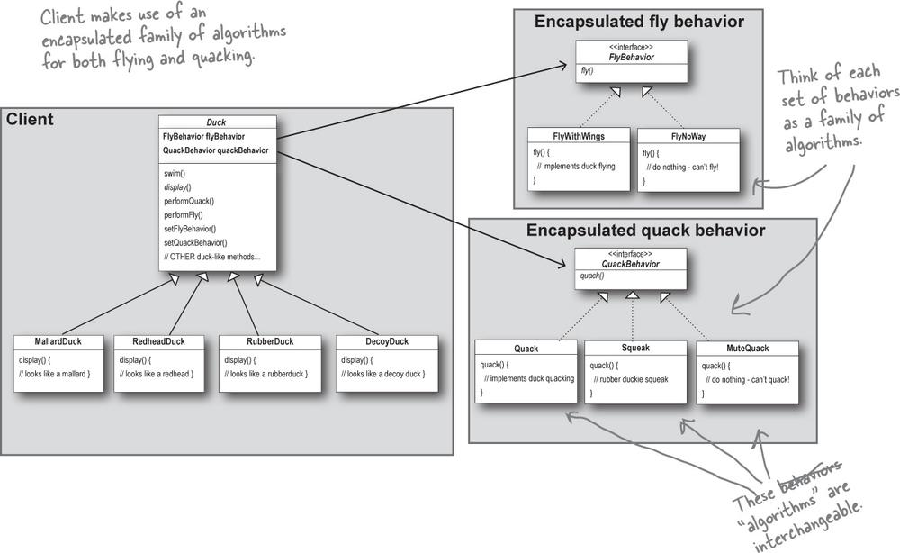

## Strategy
<strong>Паттерн Стратегия</strong> определят семейство алгоритмов, инкапсулирует каждый из них и обеспечивает их взаимозаменяемость. Он позволяет модифицировать алгоритмы независимо от их использования на стороне клиента.

------------------------------
### Links:
 
https://www.youtube.com/watch?v=v9ejT8FO-7I&t=0s&list=PLrhzvIcii6GNjpARdnO4ueTUAVR9eMBpc&index=2

------------------------------

### UML

------------------------------
### Code example 

- [Ducks](./../src/Strategy/Example1)  
- [TaxCalculator](./../src/Strategy/Example2) 

------------------------------
### TODO: 
- [ ] add UML diagram for the 2 example (`TaxCalculator`);
- [ ] improve https://www.reddit.com/r/laravel/comments/aju9mc/is_it_strategy_pattern/eezw001/ for example 2;
