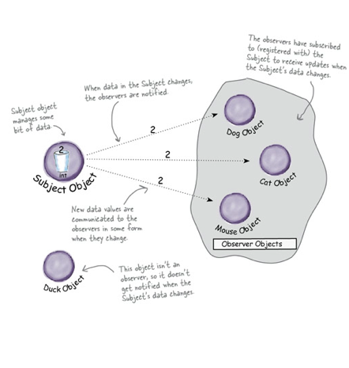
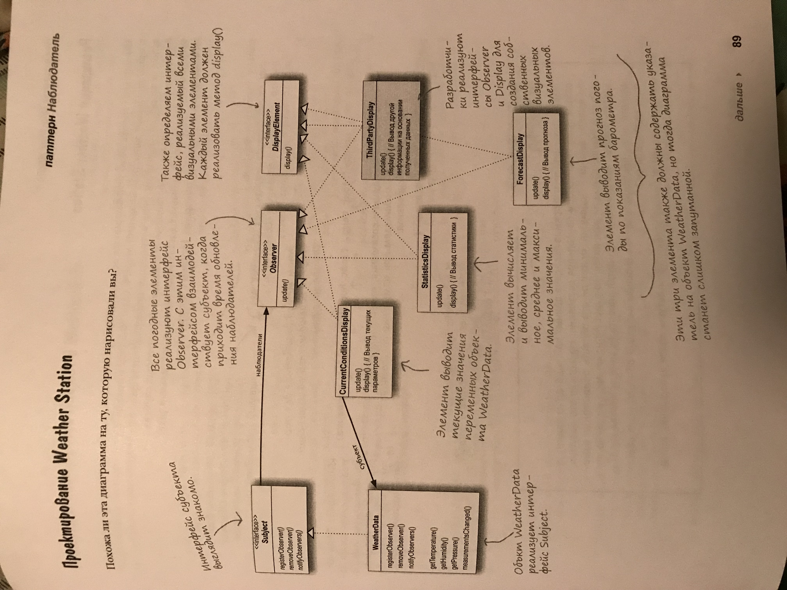

## Observer

<strong>Паттер Наблюдатель</strong> определяет отношение "один-ко-многим" между обьектами таким образом, что при изменении стостояния одного обьекта происходит автоматическое оповещение и обновление всех зависимых обьектов. 

<strong>В архитектуре паттерна Наблюдатель между судьектами и наблюдателями существует слабая связь:</strong>
- <strong>Единственнок, что знает субьект о наблюдателе, - то, что тот реализует некоторый интерфейс</strong> (Observer). Ему не нужно знать никонкретный класс наблюдателя, ни его функциональность... ничего.
- <strong>Новый наблюдатели могут добавляться в любой момент.</strong> Так как субьект зависит только от списка обьектов, реализуещих интерфейс Observer, вы можете добавлять новых наблюдателей по своему усмотрению. Любого наблюдателя во время выполнения можно заменить другим наблюдателем или исключить его из списка - субьект этого не заметит.
- <strong>Добавление новых типов наблюдателей не требует модификации субьекта. </strong> Допустим, у нас появился новый класс, который должен стать наблюдателем. Вносить изменения в субьект не потребуеться - достаточно реализировать интрфейс Observer в новом классе и зарегестрировать его в качестве наблюдателя. Субьект будет доставлять оповещения любому обьекту, реализуещему интерфейс Observer.
- <strong>Субьекты и наблюдатели могут повторно использоваться независимо друг от друга.</strong> Между ними не существует сильных связей, что позволяет повторно использовать их для других целей.
- <strong>Изменения в субьекте или наблюдателе не влияют на другую сторону.</strong> Благодаря слабым связям мы можем вносить любые изменения на любой из двух сторон - при условии, что обьект реализует необходимиый интерфейс субьекта или наблюдателя.

-------------------

### Examples:

[WeatherData](./../src/Observer/Example1) - также можна добавить метод setChanged - и оповесчать наблюдателей, только когда `changed` - true.

### TODO
[ ] Rotate image for the UML
