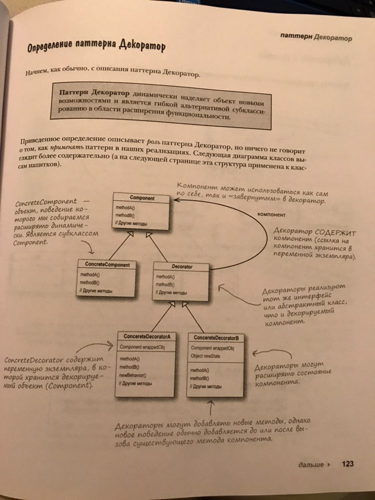
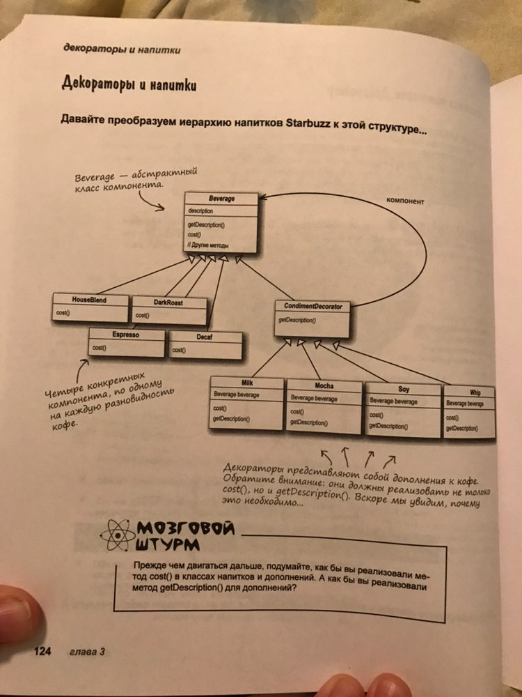

## Decorator

<strong>Паттер Декоратор</strong> динамечески наделяет обьекты новыми возможностями и являеться гибкой альтернативой субклассированию в области расширения функцональности.

### Example
- [Beverage](./../src/Decorator/Example1) | [Beverage2](./../src/Decorator/Example2)

