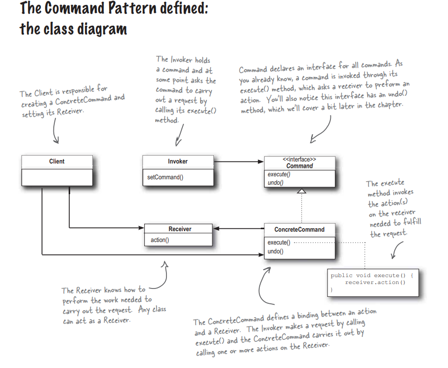
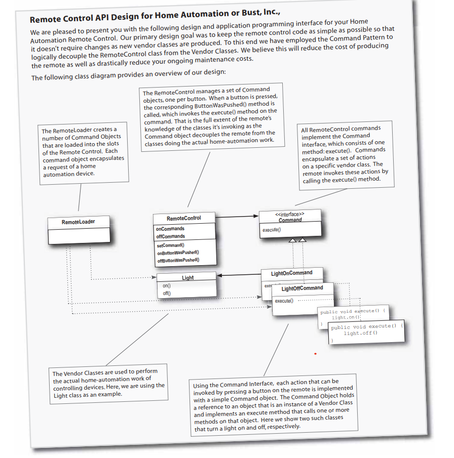

## Command

<strong>Патерн Команда</strong> инкапсулирует запрос в виде обьекта, делая возможной параметризацию клиентских обьектов с другими запросами, организацию очереди или регистрацию запросов, а также подержку отмену операций.

### Example

- [SimpleControl](./../src/Command/SimpleControl)
- [RemoteControl](./../src/Command/RemoteControl)

- [RemoteControlWithUndo](./../src/Command/UndoRemoteControl)
- [MultiControl](./../src/Command/Party)
