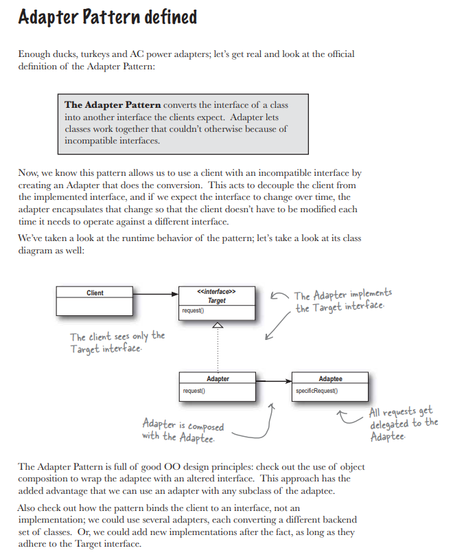

## Adapter

<strong>Патерн Адаптер</strong> преобразует интерфейс класа к другому интерфейсу, на который расчитан клиент. Адаптер обеспечивает совместную работу классов, невозмоную в обычных условиях из-за несовместимости интерфейсов.

### Example

- [Ducks](./../src/Adapter/Ducks)
