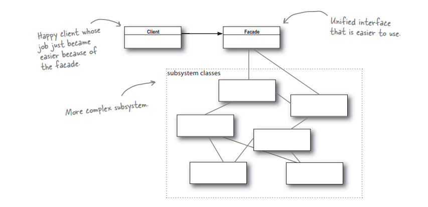

## Facade

<strong>Паттерн Фасад</strong> предоставляет унифицированый интерфейс к группе интерфейсов подсистемы. Фасад определяет высокоуровневый интерфейс, упрощающий работу с подсистемой.

### TODO:
- [ ]refactoring of Facade code example